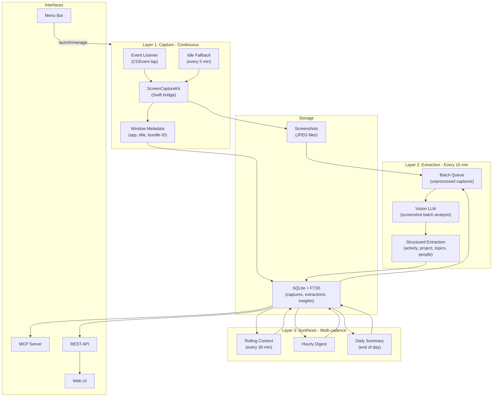

# Screencap — Lightweight Screen Memory for macOS

## Philosophy

Inspired by Tobi Lutke's 15-year practice of screenshotting his screen every 10 minutes and using AI to reason about his activity. The goal is the **simplest possible tool** that captures what you're doing, understands it deeply, and makes it searchable and useful — without the weight of Screenpipe's full audio/video/agent/plugin system.

The key insight: raw OCR text is dumb. A flat string like "function handleAuth" tells you nothing. A vision LLM seeing the same screenshot can tell you "debugging a JWT token validation issue in the auth module, Stack Overflow tab also open with a related question." The intelligence pipeline is what makes this tool actually useful, not the capture mechanism.

**Not** Screenpipe. No audio capture. No plugin system. No agent framework. No Tauri. Just: capture, understand, synthesize, search.

---

## Architecture Overview

The system has three layers that run at different cadences, each building on the one below it.



---

## Layer 1: Capture (Continuous, Offline, Cheap)

The capture layer runs constantly and never touches the network. Its job is to grab raw screenshots and basic window metadata as fast and cheaply as possible.

### Capture Strategy: Event-driven + Idle Fallback

- Listen for macOS events via `CGEventTap`: app switches, significant mouse movement, keyboard activity bursts
- On meaningful event: wait 500ms for settling, then capture
- Idle fallback: capture at least once every 5 minutes even with no activity
- Dedup: skip capture if the active window + app haven't changed since last capture AND less than 5 min elapsed
- Multi-monitor: capture all connected displays, store as separate frames with display metadata

### Per-Capture Pipeline

1. Grab screenshot via ScreenCaptureKit (Swift bridge)
2. Get active window metadata: app name, window title, bundle ID (via NSWorkspace, Swift bridge)
3. Save JPEG to `~/.screencap/screenshots/YYYY/MM/DD/HHMMSS-{display_id}.jpg` (quality 75, ~100-300KB each)
4. Insert raw capture row into SQLite with `extraction_status = 'pending'`

**No OCR at capture time.** Apple Vision OCR is skipped entirely. The vision LLM in Layer 2 does a far superior job of understanding what's on screen, and running OCR just to throw it away later is wasted CPU.

### Resource Targets

- Less than 2% CPU average (no OCR means much lighter)
- Less than 50MB RSS memory
- Zero network usage

### Language: Rust

- Best option for a long-running daemon: predictable memory, no GC pauses, excellent async runtime (tokio)
- Swift interop for macOS APIs via a thin C bridge (same pattern Screenpipe uses)
- The capture layer is intentionally trivial — grab pixels, write JPEG, insert row. Complexity lives in Layers 2 and 3.

---

## Layer 2: Extraction ("Screenshot Model") — Every 10 Minutes

This is where the intelligence starts. Every 10 minutes, the extraction pipeline wakes up, grabs all unprocessed captures since the last run, and sends them as a batch to a vision-capable LLM.

### Why Batching Is Better Than Per-Frame

Sending 5-8 sequential screenshots together gives the model temporal context. Instead of "VS Code is open," it can say "spent 10 minutes debugging a TypeScript auth error, switching between VS Code and Stack Overflow, then opened Slack to ask a teammate." The batch makes the extraction *more* useful, not less.

### Extraction Prompt

The vision LLM receives a batch of screenshots (as images) plus their window metadata, and returns structured JSON:

```
You are analyzing a batch of sequential screenshots from a user's computer.
For each screenshot, extract structured data. Then provide a batch summary.

Return JSON in this exact format:
{
  "frames": [
    {
      "capture_id": 123,
      "activity_type": "coding" | "browsing" | "communication" | "reading" | "writing" | "design" | "terminal" | "meeting" | "media" | "other",
      "description": "One sentence: what the user is doing in this frame",
      "app_context": "What the app is being used for specifically",
      "project": "Project or repo name if identifiable, null otherwise",
      "topics": ["typescript", "authentication", "JWT"],
      "people": ["@alice in Slack"],
      "key_content": "Most important visible text (code snippet, message, heading, URL)",
      "sentiment": "focused" | "exploring" | "communicating" | "idle" | "context-switching"
    }
  ],
  "batch_summary": {
    "primary_activity": "What the user was mainly doing across this batch",
    "project_context": "Which project(s) they were working on",
    "narrative": "2-3 sentence natural language summary of this time period"
  }
}
```

### Model Selection

The extraction model should be **fast and cheap** with good vision capabilities. This runs ~48 times/day (every 10 min over 8 hours), processing 5-8 images per batch.

Recommended defaults:

- **Gemini 2.0 Flash** — best price/performance for vision tasks, ~$0.10/day at this volume
- **GPT-4o-mini** — solid alternative, ~$0.15/day
- **Claude Haiku** — good quality, ~$0.20/day
- **Any vision model via OpenRouter** — single API key, access to all of the above plus open models (Llama, Mistral, etc.). OpenRouter handles routing, fallback, and rate limiting. Recommended for most users since you can switch models without changing config beyond the model name.
- **LM Studio** — local models with an OpenAI-compatible API. Run LLaVA, Moondream, or any GGUF vision model locally. Free, private, works offline. Quality varies by model but improving rapidly.
- **Ollama + LLaVA/Moondream** — also free and local, CLI-oriented alternative to LM Studio

### Cost Estimate

At ~48 batches/day, ~6 images per batch, using Gemini Flash:

- Input: ~48 batches x 6 images x ~1000 tokens/image = ~288K image tokens + ~50K text tokens/day
- Output: ~48 batches x ~500 tokens = ~24K tokens/day
- **Estimated cost: $0.05-0.15/day (~$2-5/month)**

### Extraction Storage

Each batch produces structured data that gets written back to the `extractions` table (schema below). The raw JSON is stored alongside parsed/indexed fields for fast querying.

---

## Layer 3: Synthesis ("Insights Model") — Multi-Cadence

The synthesis layer reads from extraction data and produces higher-level understanding. It runs at three cadences, each building on the one below.

### 3a. Rolling Context (Every 30 Minutes)

**Purpose:** Answer "what am I doing right now?" for MCP queries from Claude/Cursor.

**Input:** Last 30 minutes of extractions (3 batch summaries + their frame-level data).

**Output:**

```json
{
  "type": "rolling",
  "window_start": "2026-04-10T14:00:00Z",
  "window_end": "2026-04-10T14:30:00Z",
  "current_focus": "Debugging JWT token refresh in the screencap auth module",
  "active_project": "screencap",
  "apps_used": {"VS Code": "18 min", "Chrome": "8 min", "Slack": "4 min"},
  "context_switches": 3,
  "mood": "deep-focus",
  "summary": "Focused coding session on the auth module. Looked up JWT refresh token patterns on Stack Overflow, then implemented the fix in VS Code. Brief Slack check."
}
```

This is the most-queried data — when Claude asks "what is the user working on?", this is the answer.

### 3b. Hourly Digest (Every Hour)

**Purpose:** Structured record of what happened in each hour. Building block for the daily summary.

**Input:** Last hour of extractions (6 batch summaries).

**Output:**

```json
{
  "type": "hourly",
  "hour_start": "2026-04-10T14:00:00Z",
  "hour_end": "2026-04-10T15:00:00Z",
  "dominant_activity": "coding",
  "projects": [
    {"name": "screencap", "minutes": 42, "activities": ["debugging auth", "writing tests"]},
    {"name": null, "minutes": 18, "activities": ["Slack conversations", "email triage"]}
  ],
  "topics": ["JWT", "authentication", "Rust FFI", "team standup"],
  "people_interacted": ["@alice", "@bob"],
  "key_moments": [
    "Found the JWT refresh bug — was using wrong expiry field",
    "Discussed deployment timeline with Alice in Slack"
  ],
  "focus_score": 0.72,
  "narrative": "Productive coding hour. First 40 minutes deep in the auth module fixing a JWT refresh token bug. Found the issue (wrong expiry field) and wrote a fix plus tests. Last 20 minutes was communication — quick Slack thread with Alice about deployment timeline and skimming email."
}
```

### 3c. Daily Summary (End of Day or On-Demand)

**Purpose:** The "what did I do today?" view. Also feeds the timeline UI and daily log export.

**Input:** All hourly digests for the day.

**Output:**

```json
{
  "type": "daily",
  "date": "2026-04-10",
  "total_active_hours": 7.5,
  "projects": [
    {
      "name": "screencap",
      "total_minutes": 195,
      "activities": ["auth module debugging", "capture pipeline", "test writing"],
      "key_accomplishments": ["Fixed JWT refresh bug", "Added multi-monitor support"]
    },
    {
      "name": "admin",
      "total_minutes": 85,
      "activities": ["email", "Slack", "standup meeting"],
      "key_accomplishments": ["Aligned on Q2 deployment timeline with team"]
    }
  ],
  "time_allocation": {
    "coding": "3h 15m",
    "communication": "1h 25m",
    "browsing_research": "1h 10m",
    "design": "0h 45m",
    "meetings": "0h 30m",
    "other": "0h 25m"
  },
  "focus_blocks": [
    {"start": "09:15", "end": "11:45", "duration_min": 150, "project": "screencap", "quality": "deep-focus"},
    {"start": "14:00", "end": "15:30", "duration_min": 90, "project": "screencap", "quality": "moderate-focus"}
  ],
  "open_threads": [
    "Need to finish the multi-monitor edge case for ultrawide displays",
    "Alice asked about the API auth docs — haven't responded yet"
  ],
  "narrative": "Productive day focused on screencap. Two solid focus blocks: morning session on the capture pipeline (multi-monitor support) and afternoon on auth (found and fixed the JWT refresh bug). Communication was light — standup and a few Slack threads. Left the day with the ultrawide display edge case still open and an unanswered question from Alice about API docs."
}
```

### Synthesis Model Selection

The synthesis model only receives text (extraction JSON), no images. It should be **smart and good at reasoning** since it's doing analysis, not just description.

Recommended defaults:

- **Claude Sonnet** — best at narrative synthesis and structured reasoning
- **GPT-4o** — solid alternative
- **Gemini Pro** — good and cheaper
- **Any model via OpenRouter** — same benefits as extraction: one key, swap models freely. For synthesis, OpenRouter lets you easily A/B test e.g. Claude Sonnet vs GPT-4o for summary quality without code changes.
- **LM Studio** — run Llama 3, Mistral, Qwen, or any GGUF model locally. Text-only synthesis is a great fit for local models since it doesn't need vision capabilities. Quality is solid with 8B+ parameter models.
- **Ollama + Llama 3** — free, local, CLI alternative to LM Studio

### Synthesis Cost Estimate

- Rolling context: ~16 calls/day, ~2K tokens in + ~500 out each = ~40K tokens/day
- Hourly: ~8 calls/day, ~4K tokens in + ~1K out each = ~40K tokens/day
- Daily: 1 call/day, ~10K tokens in + ~2K out = ~12K tokens/day
- **Estimated cost: $0.02-0.08/day (~$1-2.50/month)**

### Combined Pipeline Cost

- Extraction (vision): ~$2-5/month
- Synthesis (text): ~$1-2.50/month
- **Total: ~$3-7.50/month for full intelligence pipeline**

---

## Storage Layer

### SQLite with FTS5 Full-Text Search

- Database location: `~/.screencap/screencap.db`
- Screenshots directory: `~/.screencap/screenshots/`

### Schema

```sql
-- Raw captures from Layer 1
CREATE TABLE captures (
    id INTEGER PRIMARY KEY AUTOINCREMENT,
    timestamp TEXT NOT NULL,              -- ISO 8601
    app_name TEXT,
    window_title TEXT,
    bundle_id TEXT,
    display_id INTEGER,
    screenshot_path TEXT NOT NULL,
    extraction_status TEXT DEFAULT 'pending',  -- 'pending', 'processed', 'failed'
    extraction_id INTEGER REFERENCES extractions(id),
    created_at TEXT DEFAULT (datetime('now'))
);

-- Structured extractions from Layer 2 (per-frame)
CREATE TABLE extractions (
    id INTEGER PRIMARY KEY AUTOINCREMENT,
    capture_id INTEGER NOT NULL REFERENCES captures(id),
    batch_id TEXT NOT NULL,               -- groups frames processed together
    activity_type TEXT,                   -- coding, browsing, communication, etc.
    description TEXT,                     -- one-sentence description
    app_context TEXT,                     -- what the app is being used for
    project TEXT,                         -- project/repo name if identifiable
    topics TEXT,                          -- JSON array of topic strings
    people TEXT,                          -- JSON array of people mentioned
    key_content TEXT,                     -- most important visible text
    sentiment TEXT,                       -- focused, exploring, communicating, etc.
    created_at TEXT DEFAULT (datetime('now'))
);

-- Batch summaries from Layer 2
CREATE TABLE extraction_batches (
    id TEXT PRIMARY KEY,                  -- UUID
    batch_start TEXT NOT NULL,
    batch_end TEXT NOT NULL,
    capture_count INTEGER,
    primary_activity TEXT,
    project_context TEXT,
    narrative TEXT,
    raw_response TEXT,                    -- full LLM response JSON for debugging
    model_used TEXT,
    tokens_used INTEGER,
    cost_cents REAL,
    created_at TEXT DEFAULT (datetime('now'))
);

-- Insights from Layer 3
CREATE TABLE insights (
    id INTEGER PRIMARY KEY AUTOINCREMENT,
    type TEXT NOT NULL,                   -- 'rolling', 'hourly', 'daily'
    window_start TEXT NOT NULL,
    window_end TEXT NOT NULL,
    data TEXT NOT NULL,                   -- full JSON output from synthesis
    narrative TEXT,                       -- extracted for FTS indexing
    model_used TEXT,
    tokens_used INTEGER,
    cost_cents REAL,
    created_at TEXT DEFAULT (datetime('now'))
);

-- Full-text search across extractions and insights
CREATE VIRTUAL TABLE search_index USING fts5(
    description,
    key_content,
    narrative,
    project,
    topics,
    content=extractions,
    content_rowid=id
);

CREATE VIRTUAL TABLE insights_fts USING fts5(
    narrative,
    content=insights,
    content_rowid=id
);

CREATE INDEX idx_captures_timestamp ON captures(timestamp);
CREATE INDEX idx_captures_app ON captures(app_name);
CREATE INDEX idx_captures_extraction_status ON captures(extraction_status);
CREATE INDEX idx_extractions_batch ON extractions(batch_id);
CREATE INDEX idx_extractions_project ON extractions(project);
CREATE INDEX idx_extractions_activity ON extractions(activity_type);
CREATE INDEX idx_insights_type_window ON insights(type, window_start);
```

### Storage Estimate

- Screenshots: ~200KB avg x 200 captures/day = ~40MB/day = **~1.2GB/month**
- SQLite (extractions + insights): ~500KB/day = **~15MB/month**
- Total: **~1.2GB/month**

---

## REST API (Built into the Daemon)

Lightweight HTTP server on `localhost:7878` using `axum` (Rust).

### Capture Endpoints

- `GET /api/captures?from={iso}&to={iso}&app={app}&limit={n}&offset={n}` — List captures chronologically
- `GET /api/captures/:id` — Get single capture with extraction data
- `GET /api/screenshots/:path` — Serve screenshot JPEG files

### Search Endpoints

- `GET /api/search?q={query}&app={app}&project={project}&from={iso}&to={iso}&limit={n}` — Full-text search across extractions and insights
- `GET /api/search/semantic?q={query}&from={iso}&to={iso}&limit={n}` — AI-powered semantic search (sends query + recent extractions to LLM)

### Insights Endpoints

- `GET /api/insights/current` — Latest rolling context (what am I doing now?)
- `GET /api/insights/hourly?date={date}` — All hourly digests for a day
- `GET /api/insights/daily?date={date}` — Daily summary
- `GET /api/insights/daily?from={date}&to={date}` — Range of daily summaries
- `GET /api/insights/projects?from={iso}&to={iso}` — Project time allocation
- `GET /api/insights/topics?from={iso}&to={iso}` — Topic frequency/trends

### System Endpoints

- `GET /api/apps` — List all captured app names with capture counts
- `GET /api/stats` — Storage usage, capture count, uptime, pipeline health, cost tracking
- `GET /api/health` — Daemon health check
- `POST /api/analyze` — Ad-hoc AI analysis of a time range (on-demand query)

---

## MCP Server

Runs as a separate entry point (`screencap mcp`) using stdio transport, conforming to the Model Context Protocol spec.

### Tools Exposed

- `get_current_context` — What is the user doing right now? (returns latest rolling context)
- `search_screen_history` — Search across extractions and insights with filters
- `get_recent_activity` — Get last N minutes of structured activity data
- `get_screenshot` — Retrieve a specific screenshot by ID (returns base64)
- `get_daily_summary` — Get the daily summary for a given date
- `get_project_activity` — Get all activity for a named project in a time range
- `get_app_usage` — Time spent in each app over a period
- `ask_about_activity` — Free-form question about activity (routes to LLM with context)

### Registration

```bash
claude mcp add screencap -- screencap mcp
```

The `get_current_context` tool is the killer feature here — it lets Claude/Cursor know what you're working on without you having to explain it. "Continue where I left off" becomes a real command.

---

## Menu Bar App (Swift, ~200 lines)

Tiny native Swift app that:

- Shows a status icon in the macOS menu bar (dot icon: green = running, yellow = processing, red = stopped)
- Dropdown menu: Start/Stop capture, Open Timeline, Open Data Folder, Preferences, Quit
- Shows current rolling context summary as a tooltip on hover
- Launches the Rust daemon as a child process on startup
- Manages launchd plist for auto-start on login
- Preferences: capture interval, excluded apps, AI provider/model/key, storage location

---

## Web UI (Static SPA Served by the Daemon)

Served from `localhost:7878/` by the Rust daemon. Built with a lightweight framework (Svelte or Preact), compiled to static files, embedded in the Rust binary.

### Views

**Timeline View**

- Horizontal scrollable timeline of the day, grouped by hour
- Each segment shows: app icon, project tag, activity type color-coding
- Click a segment to expand: see the screenshots, extraction description, key content
- Hover for quick preview
- Date picker to jump to any day
- Filter by app, project, activity type

**Insights View**

- Current rolling context card at the top ("Right now: debugging auth in screencap")
- Hourly digest cards for the day, expandable
- Daily summary with project breakdown, time allocation chart, focus blocks visualization
- "Open threads" section showing unfinished items the AI identified

**Search View**

- Full-text search bar with smart filters (app, project, date range, activity type)
- Results show extraction cards: screenshot thumbnail + description + project + topics + timestamp
- Semantic search option for natural language queries

**Stats/Analytics View**

- Time per project (bar chart, selectable date range)
- Time per app (pie/donut chart)
- Focus score trend over time
- Activity type breakdown
- Daily active hours heatmap (GitHub-contribution-style)
- Cost tracking: tokens used, cost per day/month

---

## AI Provider Architecture

All providers implement a single `LlmProvider` trait with two methods: `complete(prompt, images?) -> structured response` and `complete_text(prompt) -> string`. This keeps the pipeline code provider-agnostic.

### Provider Implementations

- **`openai_compat`** — A single HTTP client that speaks the OpenAI chat completions API format. This covers **three providers** with just a different `base_url`:
  - **OpenAI**: `https://api.openai.com/v1`
  - **OpenRouter**: `https://openrouter.ai/api/v1` — the recommended default. One API key gives access to every major model (Gemini, Claude, GPT, Llama, Mistral). Model IDs use the `provider/model` format (e.g., `google/gemini-2.0-flash`). OpenRouter handles rate limits, fallback, and cost tracking on their end.
  - **LM Studio**: `http://localhost:1234/v1` — local models, same API format. User runs LM Studio separately and loads whatever model they want. Vision support depends on the loaded model.
- **`anthropic`** — Native Anthropic Messages API. Used when talking directly to Anthropic rather than through OpenRouter (some users prefer direct API access for lower latency or to avoid the OpenRouter markup).
- **`google`** — Native Gemini API. Same reasoning as Anthropic — direct access option.
- **`ollama`** — Ollama's local API (`http://localhost:11434`). Separate from LM Studio because Ollama has its own model management and slightly different API conventions.

### Why OpenRouter as Default

OpenRouter is the recommended default because:

- One API key, one config, access to every model
- Trivial to switch models: just change the `model` string in config
- Built-in cost tracking and rate limit handling
- No vendor lock-in: if you outgrow it, switch `provider` to a direct API with no other changes
- Supports vision models for extraction and text models for synthesis through the same interface

---

## Configuration

```toml
[capture]
idle_interval_secs = 300              # 5 min fallback when idle
event_settle_ms = 500                 # wait after event before capture
jpeg_quality = 75
excluded_apps = ["1Password", "Keychain Access"]
excluded_window_titles = ["Private Browsing", "Incognito"]

[extraction]
enabled = true
interval_secs = 600                   # 10 min between extraction runs
provider = "openrouter"               # "openrouter", "openai", "anthropic", "google", "lmstudio", "ollama"
model = "google/gemini-2.0-flash"     # fast + cheap vision model (OpenRouter model ID format)
api_key_env = "OPENROUTER_API_KEY"
base_url = ""                         # auto-set per provider; override for custom endpoints
max_images_per_batch = 8

[synthesis]
enabled = true
provider = "openrouter"               # can differ from extraction provider
model = "anthropic/claude-sonnet-4-20250514"  # smarter model for reasoning
api_key_env = "OPENROUTER_API_KEY"    # same key works for both if using OpenRouter
base_url = ""
rolling_interval_secs = 1800          # 30 min
hourly_enabled = true
daily_summary_time = "18:00"          # when to generate daily summary
daily_export_markdown = true          # write daily summary to markdown file
daily_export_path = "~/.screencap/daily/"

[storage]
path = "~/.screencap"
max_age_days = 90                     # auto-prune captures older than this

[server]
port = 7878

[export]
obsidian_vault = ""                   # path to Obsidian vault for auto-sync
markdown_template = "default"         # or path to custom template
```

---

## CLI Interface

```
screencap                             # Start capture daemon (foreground)
screencap start                       # Start as background daemon
screencap stop                        # Stop daemon
screencap status                      # Daemon status, pipeline health, cost so far today

screencap now                         # Show current rolling context
screencap today                       # Show today's summary (or generate if not yet run)
screencap yesterday                   # Show yesterday's daily summary
screencap week                        # Show this week's summaries

screencap search "JWT auth bug"       # Full-text search
screencap search "JWT" --project screencap --last 24h
screencap ask "what was I doing between 2-4pm?"  # Semantic/AI search

screencap projects                    # List projects with time totals
screencap projects --last 7d          # Project breakdown for last week

screencap export --date 2026-04-10    # Export day as markdown
screencap export --last 7d --format md --output ~/Desktop/weekly.md

screencap mcp                         # Start MCP server (stdio)
screencap config                      # Open config in $EDITOR
screencap costs                       # Show AI API cost breakdown
screencap prune --older-than 90d      # Delete old captures
```

---

## Markdown Export Format

The daily export writes a markdown file that can be synced to Obsidian or any notes system.

```markdown
# 2026-04-10 (Thursday)

## Summary
Productive day focused on screencap. Two solid focus blocks: morning session on
the capture pipeline (multi-monitor support) and afternoon on auth (found and
fixed the JWT refresh bug). Communication was light.

## Time: 7h 30m active

### By Project
- **screencap** — 3h 15m (coding: auth module, capture pipeline, tests)
- **admin** — 1h 25m (email, Slack, standup)
- **research** — 1h 10m (browsing: JWT patterns, Rust FFI docs)

### By Activity
- Coding: 3h 15m
- Communication: 1h 25m
- Research/Browsing: 1h 10m
- Design: 0h 45m
- Meetings: 0h 30m

## Focus Blocks
- 09:15-11:45 (2h 30m) — screencap capture pipeline, deep focus
- 14:00-15:30 (1h 30m) — screencap auth module, moderate focus

## Key Moments
- Found the JWT refresh bug: was using wrong expiry field
- Added multi-monitor capture support
- Discussed deployment timeline with Alice

## Open Threads
- Ultrawide display edge case still unhandled
- Alice asked about API auth docs — need to respond
```

---

## Privacy and Security

- All screenshots and data stored locally by default
- Screen Recording permission required (macOS will prompt on first run)
- Excluded apps list: never capture sensitive apps (password managers, etc.)
- Excluded window title patterns (e.g., "Private Browsing", "Incognito")
- Screenshots are sent to cloud AI only during extraction batches (configurable — can use local LM Studio or Ollama instead)
- Extraction and synthesis can be fully local via LM Studio or Ollama at the cost of lower quality
- Auto-prune: configurable max age for captures
- No telemetry, no analytics
- Cost tracking: every API call is logged with token count and cost so you always know what you're spending

---

## Project Structure

```
screencap/
  Cargo.toml
  src/
    main.rs                     # CLI entry point (clap)
    daemon.rs                   # Main daemon loop, orchestrates all layers
    capture/
      mod.rs
      screenshot.rs             # ScreenCaptureKit bridge calls
      window.rs                 # Active window metadata
      events.rs                 # CGEventTap listener
    pipeline/
      mod.rs
      extraction.rs             # Layer 2: batch screenshots -> vision LLM -> structured data
      synthesis.rs              # Layer 3: extractions -> rolling/hourly/daily insights
      prompts.rs                # All LLM prompt templates
      scheduler.rs              # Manages extraction/synthesis cadences
    ai/
      mod.rs
      provider.rs               # Trait: send prompt + images, get response
      openai_compat.rs          # Shared client for OpenAI-compatible APIs (OpenAI, OpenRouter, LM Studio)
      anthropic.rs              # Anthropic native API (Messages API with vision)
      google.rs                 # Google Gemini native API
      ollama.rs                 # Ollama local API
    storage/
      mod.rs
      db.rs                     # SQLite operations, migrations
      models.rs                 # Rust structs matching DB schema
    api/
      mod.rs
      server.rs                 # Axum HTTP server
      routes.rs                 # All REST endpoints
    mcp/
      mod.rs
      server.rs                 # MCP stdio server
      tools.rs                  # MCP tool definitions
    export/
      mod.rs
      markdown.rs               # Daily summary -> markdown file
    config.rs                   # Config parsing (TOML)
  swift/
    Sources/
      ScreenCapture.swift       # ScreenCaptureKit wrapper
      WindowInfo.swift          # Active window metadata
      bridge.h                  # C header for Rust FFI
  menubar/
    ScreencapMenu/
      App.swift
      MenuBarView.swift
  web/                          # Svelte/Preact SPA source
    src/
      App.svelte
      views/
        Timeline.svelte
        Insights.svelte
        Search.svelte
        Stats.svelte
    package.json
  config.example.toml
  README.md
```

---

## What This Is NOT (Explicit Non-Goals)

- **Not an audio recorder** — no microphone/system audio capture
- **Not a plugin system** — no pipes, no scheduled agents, no markdown-defined workflows
- **Not cross-platform** — macOS only, leans hard into Apple APIs
- **Not continuous video** — discrete screenshots, not screen recording
- **Not a keylogger** — captures screenshots + window metadata, not keystrokes
- **Not Electron/Tauri** — no bundled browser runtime for the UI
- **Not free to run** — the intelligence pipeline uses paid APIs (~$3-7.50/month via OpenRouter), with a free local option via LM Studio or Ollama

---

## Build and Distribution

- Rust binary: single `screencap` binary (~5-10MB) with embedded web UI assets
- Swift menu bar app: separate lightweight .app bundle (~1MB)
- Distribution: Homebrew formula (`brew install screencap`) or direct download
- Auto-update: not in v1

---

## Comparison with Screenpipe

| Aspect | screencap | Screenpipe |
|---|---|---|
| Binary size | ~10MB | ~100MB+ |
| RAM usage | ~50-100MB | 500MB-3GB |
| CPU usage | <2% | 5-10% |
| Storage/month | ~1.2GB | 5-10GB |
| Audio capture | No | Yes (Whisper) |
| Plugin system | No | Yes (Pipes) |
| Intelligence | 3-layer LLM pipeline with structured insights | Raw OCR + search |
| Understanding | "debugging JWT auth bug in screencap project" | "VS Code open with text containing 'function validateToken'" |
| Daily summaries | Yes (automatic) | Via plugins only |
| Cross-platform | macOS only | macOS/Win/Linux |
| Running cost | ~$3-7.50/month via OpenRouter (or free with LM Studio/Ollama) | Free (local OCR) |
| Model flexibility | Any model via OpenRouter, or local via LM Studio/Ollama | Fixed to Apple Vision + Whisper |
| Setup | `brew install` + add OpenRouter API key | Download app or npx |
